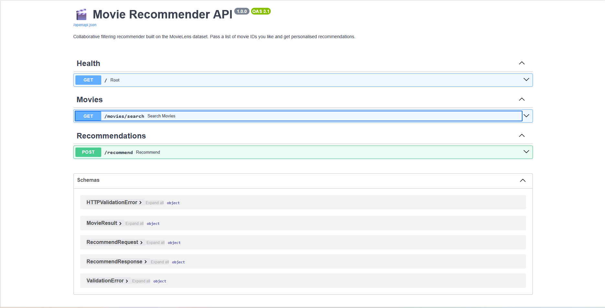

# 🎬 Movie Recommender API

A production-ready movie recommendation REST API built with **collaborative filtering (SVD)** on the [MovieLens](https://grouplens.org/datasets/movielens/) dataset, served via **FastAPI**.

Pass in movie IDs you like — get back personalised recommendations instantly.

---

## 🚀 Live Demo

> **[Try it here → your-deployment-url.com/docs]()**


---

## ✨ Features

- 🧠 **Collaborative Filtering** via Truncated SVD (matrix factorisation)
- ⚡ **FastAPI** with automatic OpenAPI docs at `/docs`
- 🔍 **Movie search** endpoint to find IDs by title
- 🐳 **Docker-ready** for one-command deployment
- 📦 Trained on 100k+ ratings from the MovieLens dataset

---

## 🛠️ Tech Stack

| Layer | Technology |
|---|---|
| Language | Python 3.11 |
| API | FastAPI + Uvicorn |
| ML | Scikit-learn (TruncatedSVD) |
| Data | Pandas, NumPy, PyArrow |
| Dataset | MovieLens Small (100k ratings) |
| Deployment | Hugging Face Spaces / Docker |

---

## ⚙️ Getting Started

### 1. Clone & install dependencies

```bash
git clone https://github.com/HusseinElMoussawi/movie-recommender
cd movie-recommender
python -m venv venv && source venv/bin/activate   # Windows: venv\Scripts\activate
pip install -r requirements.txt
```

### 2. Download the dataset

```bash
python setup_data.py
```

### 3. Train the model

```bash
python model.py
```

### 4. Run the API

```bash
uvicorn app:app --reload
```

Open **http://localhost:8000/docs** to explore the interactive API.

---

## 📡 API Endpoints

### `GET /movies/search?q=matrix`
Search for movies by title to find their IDs.

```json
[
  { "movieId": 2571, "title": "Matrix, The (1999)", "genres": "Action|Sci-Fi|Thriller" }
]
```

### `POST /recommend`
Get personalised recommendations.

**Request:**
```json
{
  "liked_movie_ids": [2571, 296, 593],
  "top_n": 5
}
```

**Response:**
```json
{
  "recommendations": [
    { "movieId": 858, "title": "Godfather, The (1972)", "genres": "Crime|Drama", "score": 0.9821 },
    ...
  ],
  "input_movie_ids": [2571, 296, 593]
}
```

---

## 🐳 Run with Docker

```bash
docker build -t movie-recommender .
docker run -p 8000:8000 movie-recommender
```

---

## 🧠 How It Works

1. **Build a user-item matrix** — rows are users, columns are movies, values are ratings.
2. **Apply Truncated SVD** — decompose the matrix into latent factors (50 dimensions), capturing hidden patterns in user preferences.
3. **Compute similarity** — given liked movies, average their latent vectors and find the most similar movies via cosine similarity.
4. **Serve results** — return top-N movies not already liked by the user.

---

## 📈 Potential Improvements

- [ ] Add user-based collaborative filtering
- [ ] Integrate content-based filtering (genres, tags)
- [ ] Add caching with Redis
- [ ] Build a small frontend with Streamlit
- [ ] Evaluation metrics (NDCG, Precision@K)

---



## 📄 License

MIT — free to use and modify.
